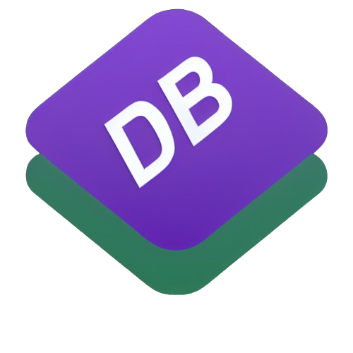

<p align="center">
  
</p>

DjangoBoot
=========================

Django Boot is a Django app framework designed for styling the admin interface with Bootstrap 5.

## Getting Started

### Prerequisites

- Google Chrome browser

### Installation

1. You can install DjangoBoot via pip:

    ```bash
    pip install django-boot
    ```
    
## Usage

To use Django Boot in your Django project, follow these steps:

1. Add `django_boot` to the INSTALLED_APPS in your settings.py file:

```python3
INSTALLED_APPS = [
    ...,
    "django_boot.apps.DjangoBootConfig",
    ...
]
```

**If you encounter any issues or have questions, feel free to open an issue for assistance.**


## Contributing
Contributions are welcome! If you have suggestions, bug reports, or want to discuss new features, please open an issue to start a discussion.

For implementing new features or fixing bugs:

1. Fork the repository.

2. Create a new branch from the `develop` branch:

    ```bash
    git checkout -b feature/your-feature-name
    ```

3. Make your changes and ensure the code follows the project's coding standards.

4. Test your changes thoroughly. If you wish to build the application, you can run the following command:

    ```python3
    python3 setup.py sdist
    ```

5. Commit your changes:

    ```bash
    git commit -m "Add your concise and meaningful commit message"
    ```

6. Push your branch to your fork:

    ```bash
    git push origin feature/your-feature-name
    ```

7. Open a pull request against the `develop` branch, describing your changes and referencing the related issue.

8. Your pull request will be reviewed, and once approved, it will be merged.

Thank you for contributing to DjangoBoot!

## License

This project is licensed under the [MIT License](LICENSE).

## Acknowledgments
DjangoBoot provides integration with the components and styles provided by Bootstrap, allowing you to easily create attractive and responsive user interfaces. Additionally, you can find additional resources such as usage examples and detailed documentation on the official Bootstrap and Django website.
- [License](https://github.com/roderiano/django-boot/blob/main/LICENSE)
- [Bootstrap 5](https://getbootstrap.com/docs/5.0/getting-started/introduction/)
- [Django Reusable Apps](https://docs.djangoproject.com/en/5.0/intro/reusable-apps/)
